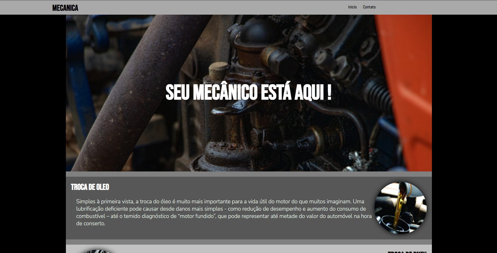
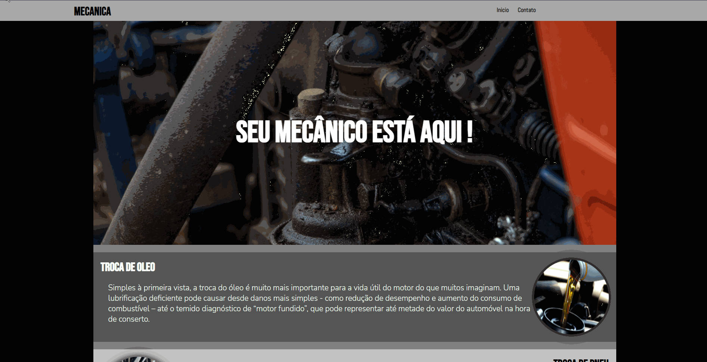

<h1 align="center">
    Projeto Mecânica
</h1>

            Primeiro projeto que fiz sozinho, utilizando HTML e CSS. não possuiu responsividade e nem muitas funções, apenas um site estático. A ideia do projeto surgiu diante de um desafio do curso do ProgramadorBr onde foi dado que deveriamos fazer um projeto para algum negócio local.

Site hospedado no netlify:
https://projetomec.netlify.app/

<h2 align="center">
Imagens do projeto:
</h2>

    
    

        Gif:
    

    
 

 ## 💻 Tecnologias

 Este Projeto foi feito utilizando:

✔️ HTML5✔️ CSS3
 
